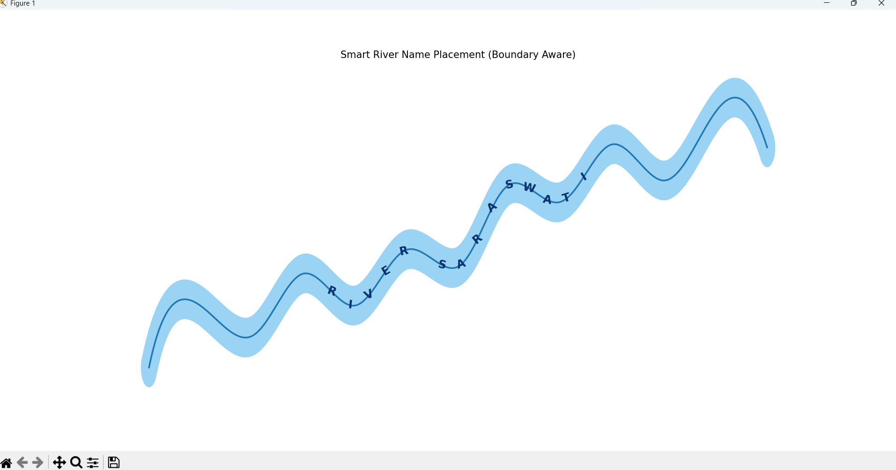

🌊 Smart River Name Placement System
* PROBLEM STATEMENT
Maps like Google Maps place river names dynamically along the river flow.
The challenge is to:
Align river names with natural flow direction
Keep text inside river boundaries
Avoid narrow areas and edges
Maintain clean map-style visualization
This project implements a computational geometry-based solution in Python.
* SOLUTION OVERVIEW
This system:
Loads real GeoJSON river data
Smooths river geometry using spline interpolation
Generates river boundaries using buffer technique
Detects safe placement region
Places river name character-by-character along river curve
Adjusts rotation dynamically based on flow direction
Ensures text remains inside river boundaries
* CORE CONCEPTS USED
Computational Geometry (Shapely)
Curve Smoothing (SciPy Splines)
Geometric Buffering for River Boundaries
Tangent-based Angle Calculation
Boundary-aware Text Placement
* THECHNOLOGIES USED
Python 3
Shapely
NumPy
SciPy
Matplotlib
* DATASET
GeoJSON river file (real_river.geojson)
Mimics real-world river coordinates (latitude-longitude format)
* HOE TO RUN
1️.Install dependencies
Copy code
Bash
pip install shapely matplotlib numpy scipy
2️.Run the script
Copy code
Bash
python river_label.py
* KEY FEATURES
✔ Curved text along river flow
✔ Boundary-aware placement
✔ Avoids edge overlap
✔ Map-style rendering
✔ Scalable for real GIS datasets
* OUTPUT PREVIEW
  
